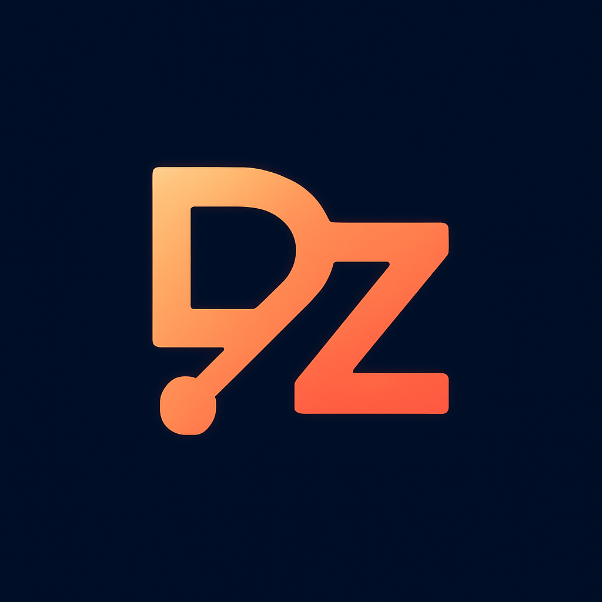
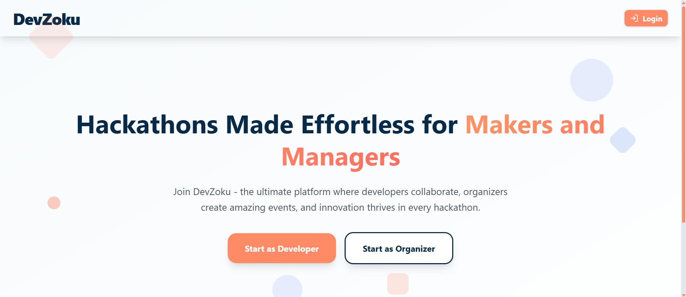
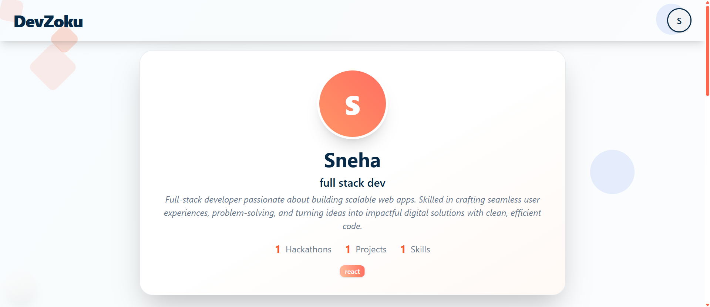
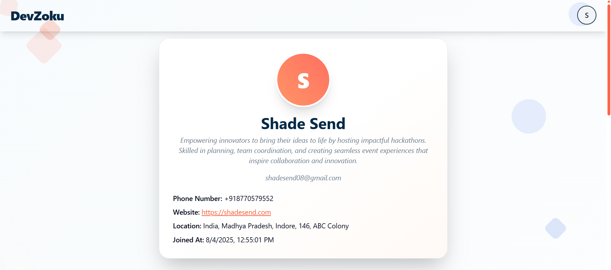

# DevZoku 🌟

**Empowering Collaboration in the World of Hackathons**

---

## 📖 Overview

DevZoku is a modern hackathon management platform built for developers, organizers, and the wider hackathon community who want to:

- Discover and join exciting hackathon opportunities

- Form teams with like-minded participants

- Execute and manage hackathons efficiently from start to finish

- Receive intelligent event and team recommendations to boost collaboration

It transforms traditional hackathons into smart, connected experiences by combining streamlined management tools, AI-driven matching, and real-time collaboration—all under one roof.

## 🖼️ UI Screenshots

## ✨ Key Features

### 👨‍💻 For Developers

- **Profile Management**: Create and customize your developer profile with skills, social links, and project portfolio.

  Complete your profile setup to showcase your expertise and connect with the community.

- **Team Collaboration**: Create teams, send invitations, and manage your team memberships.

  View all your joined teams and track sent invitations in one centralized dashboard.

- **Project Management**: Add and manage your projects with detailed descriptions and tech stacks.

  Showcase your best work to attract potential teammates and collaborators.

- **Hackathon Discovery**: Browse and view all available hackathons in the platform.

  Stay updated with upcoming events and opportunities that match your interests using Hackathon Recommendation System.

- **Notifications System**: Receive real-time notifications for team invitations and platform updates.

  Stay informed about important activities and never miss an opportunity.

### For Organizers

- **Profile Setup**: Complete your organizer profile to establish credibility and showcase your background.

  Build trust with potential participants by providing detailed information about yourself.

- **Hackathon Creation**: Create and configure hackathons with custom requirements and specifications.

  Set up events with themes, timelines, team size limits, and participation criteria.

- **Communication Tools**: Send automated email notifications to participants about important updates.

  Use professional templates for team registration confirmations and winner announcements.

---

## 🛠️ Tech Stack

### **Frontend Architecture**

- **Framework**: Next.js 15 (React 19) with TypeScript
- **Styling**: Tailwind CSS with custom component library
- **UI Components**: Radix UI primitives for accessibility
- **State Management**: React Context API with custom hooks
- **Form Handling**: React Hook Form with Zod validation
- **Animations**: Framer Motion and Lucide React icons
- **Build Tool**: Turbopack for ultra-fast development

### **Backend Infrastructure**

- **Runtime**: Bun (High-performance JavaScript runtime)
- **Framework**: Express.js with TypeScript
- **Database**: PostgreSQL 17 with Drizzle ORM
- **Caching**: Valkey (Redis-compatible) for session management
- **Vector Database**: Qdrant for AI-powered recommendations
- **Authentication**: JWT with secure cookie management
- **File Storage**: Cloudinary for media uploads

### **AI & Machine Learning**

- **Embeddings**: MistralAI for semantic understanding
- **LLM Integration**: Google Gemini for intelligent recommendations
- **Vector Search**: Qdrant for similarity matching

### **Real-time Communication**

- **WebSockets**: Socket.io for live chat and notifications
- **Message Queuing**: BullMQ with Redis for background jobs
- **Email Service**: Nodemailer with custom templates

### **DevOps & Deployment**

- **Containerization**: Docker with multi-stage builds
- **Orchestration**: Docker Compose for local development
- **CI/CD**: GitHub Actions for automated deployments
- **Database Management**: Drizzle Kit for migrations
- **Environment Management**: Secure environment variable handling

### **Development Tools**

- **Language**: TypeScript for type safety
- **Linting**: ESLint with custom configurations
- **Code Formatting**: Prettier for consistent styling
- **Database Admin**: Adminer for database management
- **API Testing**: RESTful API architecture

---

## 🌟 Why DevZoku?

### **🎯 For Developers**

- **Skill-Centric Matching**: Our AI analyzes your expertise to suggest the most relevant opportunities
- **Seamless Collaboration**: Built-in tools eliminate the friction of remote teamwork
- **Career Growth**: Track your progress and build a portfolio that showcases your hackathon journey
- **Community Building**: Connect with developers who share your interests and complement your skills
- **Time Efficiency**: Spend less time searching and more time building amazing projects

### **🏢 For Organizers**

- **Streamlined Management**: Reduce administrative overhead with automated workflows
- **Quality Assurance**: Ensure the right participants join your hackathons through intelligent filtering
- **Professional Communication**: Maintain consistent, professional interaction with all participants
- **Scalable Infrastructure**: Handle events of any size with our robust platform

### **🌍 For the Community**

- **Innovation Catalyst**: Foster breakthrough ideas through better collaboration
- **Skill Development**: Create opportunities for developers to learn and grow
- **Inclusive Environment**: Welcome developers of all skill levels and backgrounds
- **Knowledge Sharing**: Facilitate the exchange of ideas and best practices
- **Global Reach**: Connect talent across geographical boundaries

### **💡 Core Values**

- **🤝 Collaboration**: Breaking down silos between developers and organizations
- **🚀 Innovation**: Empowering creative solutions through technology
- **📈 Growth**: Supporting continuous learning and skill development
- **🌐 Accessibility**: Making hackathons accessible to developers worldwide
- **🔒 Security**: Protecting user data with enterprise-grade security measures

---

## 🎉 Final Words

DevZoku represents more than just a platform—it's a movement towards more meaningful, productive, and inclusive hackathon experiences. We believe that the best innovations emerge when the right people come together with the right tools and the right opportunities.

Our vision extends beyond traditional hackathon management. We're building a comprehensive ecosystem where:

- **Developers** can discover their next breakthrough opportunity
- **Teams** can collaborate seamlessly regardless of distance
- **Organizers** can focus on creating amazing experiences rather than administrative tasks
- **Communities** can thrive through shared knowledge and mutual support

### **🚀 Join the Revolution**

Whether you're a seasoned developer looking for your next challenge, a newcomer eager to learn and contribute, or an organizer seeking to create impactful events, DevZoku is your gateway to the future of collaborative innovation.

**Ready to transform how hackathons work?** Join thousands of developers and organizers who are already experiencing the DevZoku difference.

---

### **📞 Get Involved**

- **🐛 Found a bug?** Open an issue on our GitHub repository
- **💡 Have a feature idea?** We'd love to hear from you
- **🤝 Want to contribute?** Check out our contribution guidelines

_Built with ❤️ by the DevZoku team. Empowering developers, one hackathon at a time._

---

[🌐 Visit DevZoku](https://devzoku.app)

